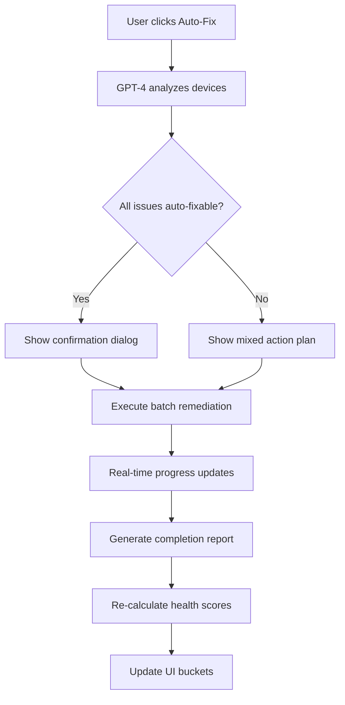

# Auto-Remediation Roadmap
**Feature: AI-Powered Device Remediation with Azure OpenAI CTA Messages**

## Overview
Integrate Azure OpenAI to analyze devices in Fair/Poor buckets and generate contextual Call-to-Action (CTA) messages with automated remediation workflows.

---

## Phase 1: Automated Remediation Engine

### Fixable Issues (Auto-Remediate)
| Issue | Detection Method | Remediation Action | Implementation |
|-------|-----------------|-------------------|----------------|
| **Client Not Checking In** | `LastActive > 30 days` | Restart SMS Agent Host service | `Restart-Service CcmExec` via ConfigMgr Run Script |
| **Missing Hardware Scan** | `LastHardwareScan > 14 days` | Trigger hardware inventory | WMI: `TriggerSchedule('{00000000-0000-0000-0000-000000000001}')` |
| **Missing Software Scan** | `LastSoftwareScan > 14 days` | Trigger software inventory | WMI: `TriggerSchedule('{00000000-0000-0000-0000-000000000002}')` |
| **No Policy Request** | `LastPolicyRequest > 7 days` | Force policy refresh | WMI: `TriggerSchedule('{00000000-0000-0000-0000-000000000021}')` |
| **Outdated Client** | `ClientVersion < 5.00.9068` | Trigger client upgrade | Deploy upgrade package via ConfigMgr |
| **Disk Space Low** | `<10GB free` | Run Disk Cleanup | PowerShell: Cleanmgr, temp file removal |

### Implementation Architecture
```csharp
// Services/DeviceRemediationService.cs
public class DeviceRemediationService
{
    public async Task<RemediationResult> RemediateDeviceAsync(string deviceName, string issueType)
    {
        return issueType switch
        {
            "ClientNotResponding" => await RestartConfigMgrClientAsync(deviceName),
            "MissingHWScan" => await TriggerHardwareInventoryAsync(deviceName),
            "MissingSWScan" => await TriggerSoftwareInventoryAsync(deviceName),
            "StalePolicy" => await ForcePolicy RefreshAsync(deviceName),
            _ => new RemediationResult { Success = false, Message = "Unknown issue type" }
        };
    }

    public async Task<BatchRemediationResult> RemediateBatchAsync(List<DeviceRemediationRequest> requests)
    {
        // Parallel execution with progress tracking
        var results = await Task.WhenAll(requests.Select(r => RemediateDeviceAsync(r.DeviceName, r.IssueType)));
        return new BatchRemediationResult { Succeeded = results.Count(r => r.Success), Failed = results.Count(r => !r.Success) };
    }
}
```

---

## Phase 2: Azure OpenAI CTA Generation

### AI-Powered Recommendations
Use Azure OpenAI to analyze device health patterns and generate personalized CTAs:

#### Example Prompts
```text
SYSTEM PROMPT:
You are a ConfigMgr/Intune migration expert. Analyze device health data and generate actionable recommendations.

USER PROMPT:
Device: LAPTOP-XYZ
- Health Score: 42 (Poor)
- LastActive: 45 days ago
- LastPolicyRequest: 60 days ago
- HardwareScan: Never
- SoftwareScan: 90 days ago
- ClientVersion: 5.00.8968 (outdated)

Generate:
1. Primary Issue (root cause)
2. 3-sentence CTA message
3. Recommended actions (prioritized)
4. Estimated fix time
5. Enrollment success prediction after fix
```

#### GPT-4 Response Format
```json
{
  "primaryIssue": "ConfigMgr client is unresponsive (45 days inactive)",
  "ctaMessage": "🚨 This device hasn't contacted ConfigMgr in 45 days. The client may be offline or the service is stopped. Restarting the SMS Agent Host service will likely restore connectivity and improve the health score from 42 to ~75.",
  "actions": [
    {
      "step": 1,
      "action": "Restart SMS Agent Host service",
      "automatable": true,
      "command": "Restart-Service CcmExec"
    },
    {
      "step": 2,
      "action": "Force policy refresh after restart",
      "automatable": true,
      "command": "Invoke-WmiMethod TriggerSchedule"
    },
    {
      "step": 3,
      "action": "Upgrade client to latest version (5.00.9068)",
      "automatable": true,
      "command": "Deploy upgrade package"
    }
  ],
  "estimatedFixTime": "15 minutes",
  "enrollmentSuccessAfterFix": 78,
  "confidence": "High"
}
```

---

## Phase 3: UI Enhancement

### Smart Enrollment UI Updates
```xml
<!-- Example UI Mockup -->
<StackPanel>
    <TextBlock Text="Fair Bucket: 250 devices" FontSize="18" FontWeight="Bold"/>
    
    <!-- AI-Powered Summary -->
    <Border Background="#FFF4E5" Padding="10" Margin="0,10,0,0">
        <StackPanel>
            <TextBlock Text="🤖 AI Insight" FontWeight="Bold"/>
            <TextBlock TextWrapping="Wrap">
                GPT-4 analyzed these devices and found that 180 devices (72%) have fixable issues:
                • 120 devices: Missing inventory scans (auto-fixable in 5 min)
                • 40 devices: Client not responding (restart recommended)
                • 20 devices: Outdated client version (upgrade available)
            </TextBlock>
            <Button Content="🔧 Auto-Fix 180 Devices" Margin="0,10,0,0" Click="AutoFix_Click"/>
        </StackPanel>
    </Border>

    <!-- Manual Actions Required -->
    <Border Background="#FFE7E7" Padding="10" Margin="0,10,0,0">
        <StackPanel>
            <TextBlock Text="⚠️ Manual Actions Required: 70 devices" FontWeight="Bold"/>
            <TextBlock TextWrapping="Wrap">
                • 45 devices: Legacy OS (Windows 7/8) - Upgrade to Win10/11 needed
                • 25 devices: No TPM detected - Enable in BIOS or replace hardware
            </TextBlock>
            <Button Content="📋 View Detailed Report" Margin="0,10,0,0" Click="ViewReport_Click"/>
        </StackPanel>
    </Border>

    <!-- Progress Tracker -->
    <StackPanel Margin="0,20,0,0" Visibility="{Binding IsRemediating}">
        <TextBlock Text="Remediation Progress"/>
        <ProgressBar Value="{Binding RemediationProgress}" Height="30"/>
        <TextBlock Text="{Binding RemediationStatus}"/>
    </StackPanel>
</StackPanel>
```

---

## Phase 4: Batch Remediation Workflow

### Execution Flow


### Safety Mechanisms
- **Dry-Run Mode**: Preview actions before execution
- **Rollback Plan**: Document pre-remediation state
- **Audit Logging**: Track all remediation actions
- **Rate Limiting**: Max 50 devices per batch to avoid overwhelming infrastructure
- **Approval Gates**: Require confirmation for risky actions (client restarts, upgrades)

---

## Phase 5: Predictive Intelligence

### Enrollment Success Predictor
Use GPT-4 to predict enrollment success after remediation:

```csharp
public class EnrollmentPredictionService
{
    public async Task<EnrollmentPrediction> PredictSuccessAsync(string deviceName, double currentHealthScore, List<string> plannedFixes)
    {
        var prompt = $@"
        Device: {deviceName}
        Current Health Score: {currentHealthScore}
        Planned Fixes: {string.Join(", ", plannedFixes)}

        Predict:
        1. Health score after fixes (0-100)
        2. Enrollment success probability (%)
        3. Confidence level (Low/Medium/High)
        4. Remaining blockers (if any)
        ";

        var response = await _openAIService.GetStructuredResponseAsync<EnrollmentPrediction>(prompt);
        return response;
    }
}
```

---

## Implementation Timeline

| Phase | Features | Effort | Dependencies |
|-------|----------|--------|--------------|
| **Phase 1** | Auto-remediation engine (6 fixable issues) | 2 weeks | ConfigMgr Admin Service, WMI access |
| **Phase 2** | Azure OpenAI CTA generation | 1 week | Azure OpenAI GPT-4 deployment |
| **Phase 3** | UI enhancements (Smart Enrollment updates) | 1 week | Phase 1 completion |
| **Phase 4** | Batch remediation workflow | 1 week | Phase 1 + 2 |
| **Phase 5** | Predictive intelligence | 2 weeks | Phase 2 + historical data |

**Total Estimated Effort**: 7 weeks

---

## Success Metrics

- **Remediation Rate**: % of Fair/Poor devices moved to Good/Excellent
- **Time Savings**: Average time saved per device vs manual fixes
- **Enrollment Improvement**: % increase in enrollment success rate after remediation
- **CTA Accuracy**: User satisfaction score for GPT-4 recommendations
- **Auto-Fix Success Rate**: % of automated fixes that succeed without manual intervention

---

## Future Enhancements

- **Proactive Monitoring**: Alert before devices drop to Fair/Poor
- **Self-Healing Agents**: Deploy agent on devices to auto-remediate without user action
- **Integration with FastTrack**: Share anonymized remediation patterns with Microsoft
- **Mobile App**: Push notifications for critical remediation needs
- **Voice Commands**: "Hey Copilot, fix all devices with stale policy"

---

## Security & Compliance

- **RBAC**: Only admins with DeviceRemediation role can execute fixes
- **Audit Trail**: Every action logged to Azure Log Analytics
- **Data Privacy**: No PII sent to Azure OpenAI (device names hashed)
- **Approval Workflow**: High-risk actions require secondary approval
- **Compliance Reports**: Generate SOC2/HIPAA audit-ready remediation logs

---

## Next Steps

1. **Prototype DeviceRemediationService** with 3 core fixes (client restart, scan triggers)
2. **Create Azure OpenAI CTA prompt template** and test with sample device data
3. **Design UI mockups** for approval from product team
4. **Set up ConfigMgr Admin Service integration** for remote command execution
5. **Establish success metrics dashboard** for monitoring rollout

---

**Author**: Zero Trust Migration Journey Team  
**Date**: January 9, 2026  
**Version**: 1.0 (Roadmap Draft)
